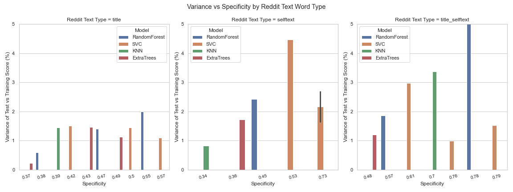
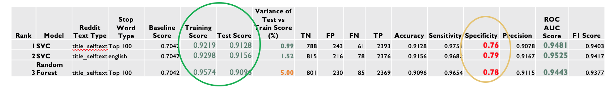

### Classifying a reddit post

### Contents:
- [Problem Statement](#Problem-Statement)
- [Summary](#Summary)
- [Data Dictionary](#Data-Dictionary)
- [Methodology](#Methodology)
- [Findings and Observations](#Findings-and-Observations)
- [Cross-Post](#Cross-Post)
- [Best Models](#Best-Models)
- [Conclusions](#Conclusions)
- [Next Steps](#Next-Steps)
- [Bibliography](#Bibliography)

#### Problem Statement

A data scientist has been hired by the Reddit Moderators to figure out how to increase karma when two subreddits are similar. 
New groups, particularly when the new one is a specialized version or a subset of the broader community group tend to have less engagement initially. When a new post is being submitted, if we can auto-submit it to the newer subreddit, it increases its visibility and provides a higher chance for the posters to get more upvotes and hence increase their karma (the Reddit equivalent of points).

Examples: marketing and social media marketing; fitness and running, or Running and CouchTo5K (a group for first-time runners to get to run a distance of 5km). 

This service will also provide a solution by cross-posting to both subreddits if we cannot predict reliably, with the aim to fit within the Reddiquette guidelines. 

#### Summary

How similar are the two subreddits? 
Can we reduce their similarity to improve our classification? 
What part of the Reddit submission should we look at - the Title, the selftext (body of post content) or a combination of both (concatenation of Title and selftext)
Which Machine Learning models should we consider? 
How do we compare the performance of the models and pick one? 
Which metrics are most relevant? 

Using data obtained from [Pushshift's](https://github.com/pushshift/api) API, we'll collect posts from the running and c25k subreddits. 
We will then use NLP to train a classifier on which subreddit a given post came from. 
We will determine which classification metrics are most relevant in our scenario. 

We will also verify the performance of our model and see how close our predictions are and how well we could extend this for other subreddits and if we can extend this from binary classification to multi-class. 

#### Data Dictionary

Running and c25k are the two subreddits. 
We are pulling data using the Pushshift API, a hundred posts at a time. We will attempt to get about 10,000 posts, ideally from each subreddit to get a balanced set for our classifier. Since the focus is on NLP, we will ignore the author, score, and number of comments and focus on tokenizing the title and selftext.

#### Input Data

#### Output Data files

* [`running.csv`](../data/running.csv): Data from the Reddit running subreddit
* [`c25k.csv`](../data/c25k.csv): Data from the Reddit c25k subreddit

#### Intermediate Data files

To provide a cleaner break between the different facets of modeling and to permit simpler navigation across notebooks, I created a number of intermediate files. These files are used in the model training and evaluation in notebooks 2 and 3. 

**Model evaluation metrics for each of the 4 classifiers**

best_rf_results_df.csv  
svc_results_df.csv  
knn_results_df.csv  
et_results_df.csv  

**Pickle files for the stop words**
stop_words_100_body.pkl  
stop_words_100_t_s.pkl  
stop_words_100_title.pkl  
stop_words_1000_body.pkl  
stop_words_1000_t_s.pkl  
stop_words_1000_title.pkl  
stop_words.pkl  

#### Image files
For presentation purposes

#### Methodology
**NLP and Classification:** 
Getting the reddit data using Pushshift is super straightforward. 
After doing the preliminary EDA, the only columns of interest are the Title and selftext (body).   

2 main areas had to be investigated: 
1. Whether to tokenize title, selftext or both
2. Not surprisingly, there are many words in common between the two subreddits. How do we figure out the list of stop words that the classifier can ignore? How many tokens should we use in our stop word list - just the default english (that comes from sklearn), the Top 100 or the Top 1000 common across both subreddits? (pickled the stop_words file for access by GridSearch)

I used the CountVectorizer and TF-IDF Transformer to vectorize the title and selftext, then tried multiple Classifiers using a two-step approach. 
In the first step, using GridSearch, I determined the optimal parameters for CountVectorizer and each of the classifiers - Random Forest, Support Vector Classifier (SVC), KNN and Extra Trees Classifier. 

**Psuedo-Hyperparameters:**

Do we tokenize title, or selftext or both? 
How many stop words to use: 10, 100, 1000? 
Hmmm, these smell like hyper-parameters  - these are my pseudo-hyper-parameters!

I then tried out all 9 combinations of (title, selftext, title_selftext with english, Top 100 and Top 1000 stop words) in a neat little MetaGridSearch function, obtained all the classification metrics and stored the results in a dataframe, for each of the four classifiers. Each of these was written to disk and then later merged together to create a composite results dataframe for comparing all the models. 

**Model Evaluation:** 
After analyzing the classification metrics with various visualizations, deciding which ones are the most relevant in our scenario. 

## Findings and Observations

**NLP Findings:**

- Pre-processing of data and EDA is super important. A lot more important than spending time on tuning models with GridSearch

- More data helps in training  
Without getting more observations (I seem to have to maxed out the posts from the c25k sub, even though I went back 5 years), using the title+selftext made a huge difference to the model performance. The Training Score/Test Score went up from 0.87/0.85 to 0.96/0.91 a tremendous improvement in accuracy of 15% with only a small increase of variance. I had to iterate through the 3 scenarios - title only, selftext only and title+selftext as my pseudo-hyper-paramters to see which resulted in better metrics. This also helped me in prioritizing Specificity as the metric to optimize since all the other metrics were already above 90%, whereas Specificity ranged from 0.3 to 0.8. 

- Stop Words matter!   
Computing the words common to both subreddits took some doing with a 2-phase approach. The first phase was to optimize the CountVectorizer using the default english list from sklearn to get the top words and then taking the intersection of the lists to get the Top 100 and Top 1000 stop words. The Vectorizer had to be tuned again with this new set of stop words, for all three lists - english, Top 100 and Top 1000. These essentially became my pseudo-hyper-parameters.   

    Using the Top 100 common words as the list of stop words to ignore (after adding this to the default english list), made a huge difference to model performance. It increased Training/Test Score to 0.96 and 0.91 and reduced variance 

**Classification Model Findings:**
- Iterating over GridSearch is slow. Lots of trial and error and yet there is no guarantee that the optimal hyper-parameters are found
- The classes were not very well balanced - I had 10000 observations for running and about 3000 for the negative class c25k (after removing nulls and dups). The results were still very good. 
- **Random Forest:** 
    - Even though the optimal hyperparameters were max_depth=70 and min_samples_leaf=1, which pointed to severe overfitting, due to the stop words, the Training Score/Test Score was 0.96 and 0.91 respectively, with the percentage decrease being 5% which is not a lot of overfitting. The False Positives were a bit high (Specificity=0.78) and ROC AUC score= 0.94 showing a good separation of our classes. All other scores are well above 0.9
    
    - I had expected to see quite poor accuracy because of the very similar nature of the 2 subreddits. Due to the insights gained during EDA, the performance of the Random Forest model was significantly improved by utilizing more text and by using custom stop words. 
    - By adding the stop words common to both the subreddits,  we are able to separate the classes significantly. Interestingly, **75 words out of the top 100 are the common across both subreddits and 689 out of top 1000 are common in both!** 

    - Another interesting point to note: You'd think that adding more words to the stop words would be better. It does remove the overfit entirely at the cost of lower accuracy and lower Specificity. The Training and Test scores drop (about 7%, and there is almost no overfit), **BUT the specificity drops tremendously** as our False Positives double. 

**We need to figure out what metric matters the most to us, if we are wiling to live with a larger number of False Positives maybe we go with lower accuracy but very low variance (less than 2%)**

- **SVC:** 
    - Lot slower to fit, especially because I turned on getting the probability (which does an extra set of 5 cross-folds)
    - In SVC, the **predicted probability does not match with prediction**. i.e. if predicted is < 0.5, predicted can be 1 and vice-versa too. 60 cases where predicted is 1 and predicted proba is less than 0.5 and 0 cases where predicted is 0 and predicted proba is > 0.5. See References for explanation. 
    - SVC performed the best of all the 4 models considered. 
    - Suprprisngly, SVC GridSearch consistently picked the sigmoid kernel.
     

## Cross-Posting

A post could belong equally to either or both subreddits.  

There are many borderline cases where the model is not very confident. Humans also may not be able correctly identify which group is more appropriate.   

**Text**: I've never been a runner, but yesterday I ran a mile in 10 minutes. How do I improve?  

Model **Predicted proba: 0.46; Predicted: 0 (c25k); Actual: 1(running) False Negative**

- Cross-posting increases Reddit karma by having deeper conversations in more meaningful communities, increasing upvotes
- Added advantage of reducing our False Positives and False Negatives by moving our threshold in each direction. Setting the red dotted bar to 0.4, will eliminate the above FN because it will now be posted to the c25k subreddit also.   

Additional Examples:   
    i: 30, Predicted Prob: 0.48, Predicted: 0, Actual: 1, Text: Finally completed my first half marathon.\nUnfortunately, I had to do this by myself since there are   
i: 48, Predicted Prob: 0.58, Predicted: 1, Actual: 0, Text: Looking for Strava clubs!.\nHey, peeps! Anyone here walk or jog using Strava? I'm new to the app    
i: 69, Predicted Prob: 0.41, Predicted: 0, Actual: 0, Text: Derailed by an injury.\nI was on such a roll going into W4 and feeling strong when I tweaked my back     
i: 76, Predicted Prob: 0.54, Predicted: 1, Actual: 0, Text: W9D1 was an epic fail..\nGot about 16 minutes into the run and had to stop to walk for 30 seconds.

 
## Comparing all 4 Classifiers
Ideal: Highest Training Score (and closest Test Score i.e. low variance, below 2%) and highest Specificity

- SVC shows low variance of 1% with high Specificity (0.76 and 0.79) (green circled area in rightmost graph)
- Random Forest and KNN also do quite well. Extra Trees not so well
- In the first graph, the variance is low (all below 2% but the Specificity is very low (too many FP)

We want low variance and high Specificity. We see graph #3 (with title_selftext, rightmost) has the best results. SVC shows high Specificity (0.76 and 0.79) with low variance of 1%.   
Random Forest and KNN also do quite well, though not as well as SVC. Any of the three models on the rightmost will work well.   
In the first graph, the variance is low (all below 2% but the Specificity is very low. As we have seen previously too, training the model on more data helps improve performance. 
SVC performs well with just the selftext too, though not as well as with title_selftext.

## Best Models
**And the winner is… SVC
... wait, what? or is it Random Forest?**  

- 92% accuracy
- The Test Score is only 1% lower than the Training Score, implying almost no overfit! 
- SVC: predict_proba doesn’t match with prediction. So Random Forrest may be the winner given that cross-posting is important in our scenario

From sk-learn documentation:   
predict_probas is using the Platt scaling feature of libsvm to callibrate probabilities, 
The cross-validation involved in Platt scaling is an expensive operation for large datasets. In addition, the probability estimates may be inconsistent with the scores:
the “argmax” of the scores may not be the argmax of the probabilities
in binary classification, a sample may be labeled by predict as belonging to the positive class even if the output of predict_proba is less than 0.5; and similarly, it could be labeled as negative even if the output of predict_proba is more than 0.5.
Platt’s method is also known to have theoretical issues. If confidence scores are required, but these do not have to be probabilities, then it is advisable to set probability=False and use decision_function instead of predict_proba  
Source: https://scikit-learn.org/stable/modules/svm.html#scores-probabilities

Best Params:
cvec__max_df: 0.97,
cvec__max_features: 4000,
cvec__min_df: 2,
cvec__stop_words: 'english',
svc__C: 0.8889,
svc__degree: 2,
svc__kernel: 'sigmoid',
svc__probability: True,
tfidf__use_idf: True}

## Conclusions
  

- Pre-processing of data and EDA is super important. More than spending -time on tuning model with hyper-parameters with GridSearch
- Accuracy by itself is not critical for all use cases. Pick your metric!
- Random Forest max_depth of the Decision Tree is 70, still test score is fine and the model is not overfit at all, due to pre-processing of data
- SVC: predict_proba doesn’t match with prediction
- Evaluation metrics may not be the final decider in choosing the best model! 

## Next Steps

- With a high accuracy of 92%, and low variance, the model is good to go! 
- Still room for improvement: 
    - Lemmatize, stemming
    - Top 300 or Top 500 - hyper-param tuning for stop words
    - KNN more tuning 
    - Extend from binary classification to multi-class
    - Can maybe try more balanced classes: currently baseline is 70%, could maybe try oversampling majority and under-sampling minority class
    - Clean up warnings: 
        - UserWarning: Your stop_words may be inconsistent with your preprocessing. Tokenizing the stop words generated tokens ['running'] not in stop_words. 

## Bibliography 

+ Adding words to scikit-learn's CountVectorizer's stop list - Stack Overflow   
Source: https://stackoverflow.com/questions/63061046/how-to-change-the-number-or-rows-and-columns-in-my-seaborn-catplot

+ How to change the number or rows and columns in my seaborn catplot - Stack Overflow  
Source: https://stackoverflow.com/questions/63061046/how-to-change-the-number-or-rows-and-columns-in-my-seaborn-catplot

+ Plot ROC curve  
Source: https://github.com/justmarkham/scikit-learn-videos/blob/master/09_classification_metrics.ipynb

+ SVC predict_proba doesn’t match with predictions  
Source: https://scikit-learn.org/stable/modules/svm.html#scores-probabilities

+ Image credit: Reddit karma
Source: https://www.techtricknews.com/how-to-get-karma-on-reddit/